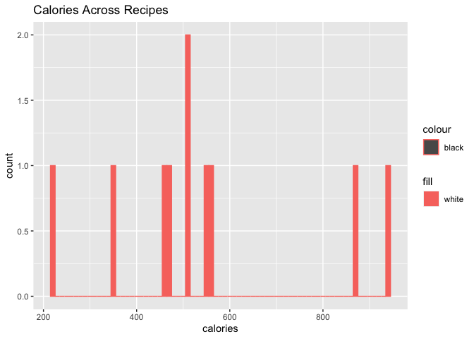

ST 558 Project 1: Food Data
================
Ashlee McKeon
June 23, 2022

-   [Requirements](#requirements)
-   [API Connection to spoonacularAPI and Initial Interest
    Query](#api-connection-to-spoonacularapi-and-initial-interest-query)
-   [API Interaction Functions](#api-interaction-functions)
-   [API Data Exploration](#api-data-exploration)
    -   [Contigency Tables](#contigency-tables)
    -   [Numerical Summaries](#numerical-summaries)
    -   [Graphical Displays](#graphical-displays)
-   [Wrap Up](#wrap-up)

This document is a vignette to show how to connect to, retrieve, and
summarize data from the spoonacularAPI, which is a repository of
hundreds of recipes with advanced filtering capabilities.

## Requirements

I loaded the following packages to use the functions I’ve created for
interacting with the <https://spoonacular.com/food-api/docs>. Please
find below package names and brief descriptions of their function.

-   `tidyverse`: Collection of R packages used for data science  
-   `httr`: API connection  
-   `jsonlite`: API interaction

I also used the following packages to help execute additional code in
this document.

-   `knitr`: Setting global options and displaying user friendly
    tables  
-   `render`: Converting rmarkdown files into output files  
-   `ggplot2`: Creating data visualizations

## API Connection to spoonacularAPI and Initial Interest Query

I wrote the function below to connect to the spoonacularAPI. I then ran
a query to return Greek recipes, and only those Greek recipes that had
at least 15 grams of protein in them. The str() was then used to learn
more about what data this query contained to ensure I returned the
information I was expecting.

``` r
recipeQuery <- GET("https://api.spoonacular.com/recipes/findByNutrients?apiKey=e0017c250919436bb0c6869b0c6d5ea1&cuisine=Greek&minProtein=15") #Connect to spoonacularAPI

str(recipeQuery, max.level = 2) #assess the structure of the query
```

Now we will navigate to the content that has each recipe’s macronutrient
information in it. We then save that as an R object, selecting only the
recipe title, calories, protein, fat, and carbs columns. Finally, we
save and print out the data as a tibble/data frame so it will be easy to
work with further.

``` r
recipes <- fromJSON(rawToChar(recipeQuery$content))
str(recipes, max.level = 2) #will #show the structure of recipes
```

``` r
recipes_df <- select(recipes, title, calories, protein, fat, carbs)
recipes_df
```

We now have a parsed data frame to work with that includes the recipe
content we are interested in!

## API Interaction Functions

I wrote several functions that will allow for further interaction with
the spoonacularAPI by other users. Users will be able to modify the code
below to customize their own queries to return the specific data they
are interested in.

``` r
spoonacularAPIWrapper <- function(cuisineType, dietType, maxCalories, minProtein, maxCarbs, maxFat) {
  url <- paste0("https://api.spoonacular.com/recipes/findByNutrients?apiKey=e0017c250919436bb0c6869b0c6d5ea1", "&cuisine=", cuisineType,"&diet=", dietType, "&maxCalories=", maxCalories,"&minProtein=", minProtein, "&maxCarbs=", maxCarbs,"&maxFat=", maxFat)
  userRecipeQuery <- GET(url)
}
```

## API Data Exploration

Now that we are able to connect with and query the spoonacularAPI based
on areas of interest, we can begin to explore the data through
contingency tables, numerical summaries, and graphical displays.

But first, let’s learn a bit more about the macronutrients of Greek
recipes in the spoonacularAPI.

We are going to focus on calories, protein, fat, carbs. Since each of
the macronutrient columns come with their unit of measurement
(i.e. grams) attached, we need to first remove the unit and then convert
the character string to a numeric. Given we are also interested in
whether a recipe is either HIGH or LOW in protein, carbs or fat, we also
need to create new variables that takes the values of each in grams and
transforms it into a HIGH or LOW string variable. The code for the
creation of these new variables is below.

``` r
recipes_df$protein <- substr(recipes_df$protein,1,nchar(recipes_df$protein)-1) #remove unit from char string vector
recipes_df$protein <- as.numeric(recipes_df$protein)

recipes_df$carbs <- substr(recipes_df$carbs,1,nchar(recipes_df$carbs)-1) 
recipes_df$carbs <- as.numeric(recipes_df$carbs)

recipes_df$fat <- substr(recipes_df$fat,1,nchar(recipes_df$fat)-1) 
recipes_df$fat <- as.numeric(recipes_df$fat)

caloriesRanking <- ifelse (recipes_df$calories>500, "HIGH", "LOW")
proteinRanking <- ifelse (recipes_df$protein>30, "HIGH", "LOW")
carbsRanking <- ifelse (recipes_df$carbs>50, "HIGH", "LOW")
fatRanking <- ifelse (recipes_df$fat>20, "HIGH", "LOW")

recipes_df <- cbind(recipes_df, caloriesRanking, proteinRanking, carbsRanking, fatRanking) #add ranking variables as new columns into recipes_df
recipes_df
```

### Contigency Tables

Now our data frame is ready for exploratory analysis!

#### One-Way Contingency Table

We can examine how many of the recipes are high and low in protein.

``` r
oneWayMacros <- recipes_df %>%
  group_by(proteinRanking) %>%
  summarise(count = n())
oneWayMacros
```

**Intepretation:** The majority of recipes are high in protein
(i.e. \>30g).

#### Two Way Contingency Table

We can also determine how many recipes are both high in protein and low
in carbs, for those looking for carb control and the facilitation of
building lean muscle mass.

``` r
twoWayMacros <- recipes_df %>%
  group_by(proteinRanking, carbsRanking) %>%
  summarise(count = n()) 
twoWayMacros
```

**Intepretation:** 40% or 4/10 recipes are high in protein (i.e., \>30g)
and low in carbs (i.e., \<=50g).

#### Three-Way Contingency Table

If we are interested in knowing of the recipes that are high in protein,
how many of them are also both low in carb and low in fat?

``` r
threeWayMacros <- recipes_df %>%
  group_by(proteinRanking, carbsRanking, fatRanking) %>%
  summarise(count = n()) 
threeWayMacros
```

**Intepretation:** Only 2 high protein recipes in the spoonacularAPI are
also low in carb and low in fat (i.e., \<20g).

### Numerical Summaries

We’ve explored our categorical variables a bit, but our data frame also
provided a variety of quantitative variables that allow for further
analysis. What if we were interested in knowing more about the center,
spread, and distribution of the quantitative variable calories, protein,
carbs, and fats and how they vary across all levels of categorical
variables caloriesRanking, proteinRanking, carbsRanking, fatRanking?

Let’s start by calculating the five number summary for our quantitative
variables. This will tell us the minimum, the first quartile, the
median, the third quartile, and the maximum.

``` r
sapply(recipes_df[c('calories', 'protein', 'carbs', 'fat')], fivenum)
```

    ##      calories protein carbs  fat
    ## [1,]    217.0    17.0   3.0  7.0
    ## [2,]    458.0    29.0  22.0 16.0
    ## [3,]    510.5    31.5  40.5 23.5
    ## [4,]    558.0    45.0  59.0 37.0
    ## [5,]    937.0    83.0  64.0 51.0

### Graphical Displays

#### Histogram

Let’s look at the frequency of calories across our recipes.

``` r
caloriesHistogram <- ggplot(recipes_df, aes(x = calories))  
caloriesHistogram + geom_histogram(aes(color="black", fill="white"), binwidth = 10, bins = 10) +
  labs(title = "Calories Across Recipes") 
```

<!-- --> *Intepretation:*
Calories vary so widely across recipes that it is highly uncommon for
more than one recipe to have the same number of calories, especially
with such a small sample size. It is recommended that this type of graph
not be used on these data in the future. If a histogram is needed for
these data consider recoded the number of calories for each recipe into
“bins” made up of ranges of calories, this way more recipes fall in each
bin. That strategy with larger sample size would make this visual more
meaningful. It’s always important to see what doesn’t work though!

#### Scatterplot 1

What if we now wanted to know if there is a relationship between the
amount of protein in a recipe and the amount of carbs? A scatterplot can
help us do that.

``` r
correlationOne <- cor(recipes_df$protein, recipes_df$carbs, method= "spearman")

scatterplotProteinCarbs <- ggplot(recipes_df, aes(x = protein, y = carbs)) 
scatterplotProteinCarbs + geom_point() + 
  labs(title = "Protein vs Carbs", x = "Protein (grams)", y = "Carbs (grams)") +
  geom_text(x = 70, y = 10, size = 4, label = paste0("Correlation = ", round(correlationOne, 2))) 
```

<!-- -->
*Intepretation:* There is a very weak positive linear relationship
between the amount of protein a recipe has and the amount of carbs it
has.

#### Scatterplot 2

One may logically expect that a recipe that is high in fat will also be
high in calories. Let’s now explore if a relationship exists between
these two variables in our data frame. Again, we can use a scatterplot
to visually evaluate this relationship.

``` r
correlationTwo <- cor(recipes_df$fat, recipes_df$calories, method= "spearman")

scatterplotFatCalories <- ggplot(recipes_df, aes(x = fat, y = calories)) 
scatterplotFatCalories + geom_point() + 
  labs(title = "Fat vs. Calories", x = "Fat (grams)", y = "Calories") +
  geom_text(x = 40, y = 300, size = 4, label = paste0("Correlation = ", round(correlationTwo, 2))) 
```

<!-- -->
*Intepretation:* There is a very strong positive linear relationship
between the amount of fat a recipe has and the number of calories in
that recipe.

#### Box Plot

What if we wanted to get a more visual sense of the five number
summaries for fat, but fat across the levels of calorie rankings in the
recipes. That is, how does the distribution of fat vary between recipes
that are considered HIGH in calories and recipes considered LOW in
calories? A box plot is a great way to do that! Box plots also have the
ability to determine if there are any statistical outliers in the
distribution of the data.

``` r
boxPlotFat <- ggplot(recipes_df, aes(x = fat, y = caloriesRanking))
boxPlotFat + geom_boxplot(fill = "blue") +
  labs(title = "Boxplot for Fats Across Both Levels of Calorie Rankings", x= "Fat", y= "Calorie Ranking")
```

<!-- -->
*Intepretation:* The boxplot shows that the distribution for fats in
recipes LOW in calories is a bit skewed to the right, with a very small
spread in the data. We do also see one statistical outlier. For recipes
considered HIGH in calories we see a normal distirbution of fat across
recipes, but with a much wider spread when compared to the recipes
ranked LOW in calories. No statistical outliers are detected here.

#### Bar Plot

``` r
macrosBarPlot <- ggplot(recipes_df, aes(x= proteinRanking)) 
macrosBarPlot + geom_bar(fill="pink") +
  labs(title = "Protein Ranking Barplot", x= "Protein Ranking", y= "Count") 
```

<!-- -->
*Intepretation:* There are more recipes in this data frame that are
considered HIGH in protein, than LOW in protein. However, it is worth
noting that with such a small sample size it is difficult to tell if
this pattern is representative of the true rate of proteinRanking in the
population of all Greek recipes.

## Wrap Up

To summarize what I did to execute this project:

-   I installed and loaded the packages needed for connection, query,
    and analysis of the spoonacularAPI.
-   I then made a connection to the spoonacularAPI and queried the API
    to return content on multiple criteria of interest. I also saved
    that content into a more usable data frame for further analysis.  
-   I then created functions that will allow a user to run their own
    queries of interest on the spoonacularAPI.
-   Finally, I explored the data frame I made using contingency tables,
    numeric summaries, and graphical displays of categorical and
    quantitative data.
    -   My exploratory analyses generated several interesting findings.
        The most notable findings were the strong relationship between
        the amount of fat a recipe had and the number of calories in
        that recipe. Also interested was the lack of a relationship
        between protein and carbs. I would have thought that
        relationship would be at least a bit stronger than it was. This
        information can be very informative to individuals wanting to
        better understand the macronutrient breakdown commonly found in
        Greek recipes. The functions in this documentation can also be
        easily modified by users wanting to learn about different
        parameters related to recipes than what I used in the current
        document.
